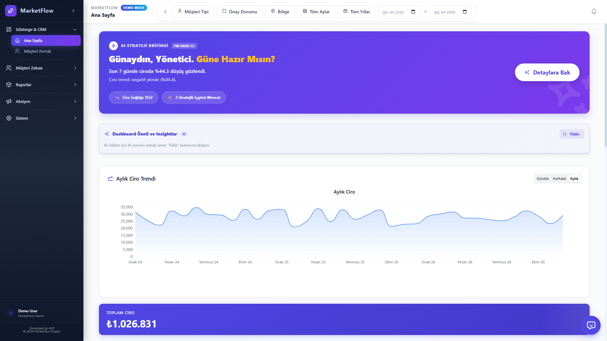
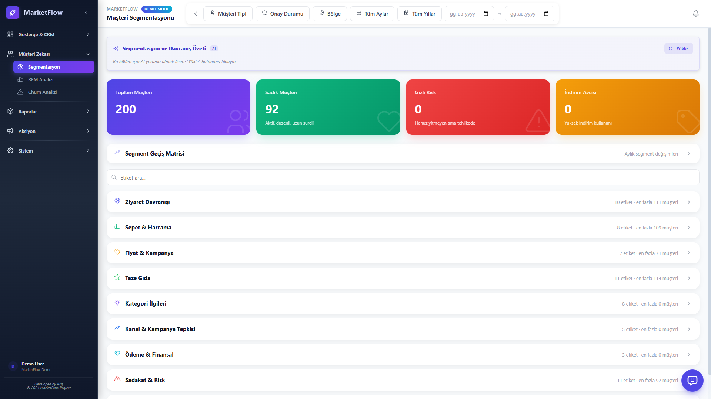
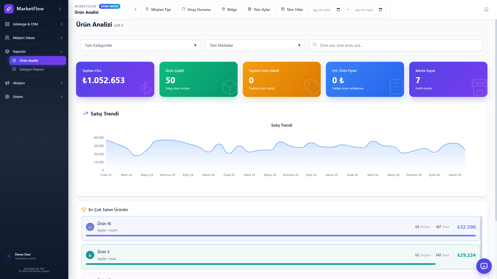
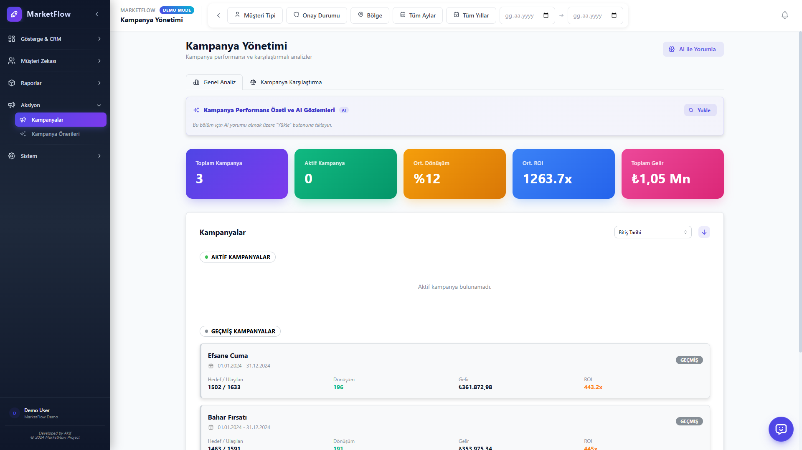
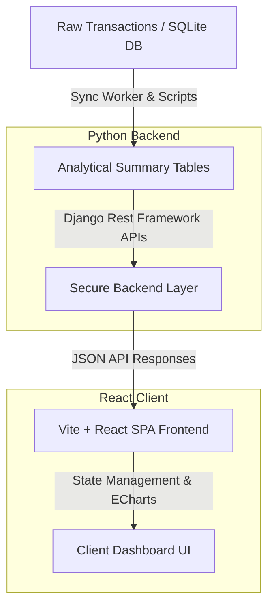

# 🚀 MarketFlow: AI-Powered Retail Analytics & CRM Platform
### 📊 Yapay Zekâ Destekli Perakende Analitiği ve Müşteri İlişkileri Yönetimi Platformu

[English](#english) | [Türkçe](#türkçe)

---

## English

MarketFlow is an enterprise-grade, full-stack retail analytics and CRM dashboard application. Designed for modern retail operations, it transforms raw transactional data into actionable insights through advanced product performance tracking, RFM (Recency, Frequency, Monetary) segmentation, cohort analysis, and AI-driven campaign recommendation engines.

> [!NOTE]
> This repository contains a fully functional, sanitized demo version of the platform. All personally identifiable information (PII), proprietary business names, and sensitive credentials have been completely scrubbed and replaced with generic mock datasets powered by a local SQLite engine.

### 📸 Screenshots
<p align="center">
  
  
</p>
<p align="center">
  
  
</p>

### ✨ Key Features
- **📊 Interactive Executive Dashboard**: High-fidelity visualization of key business metrics (Revenue, AOV, Active Customers, Churn Rate) using Apache ECharts.
- **🎯 Advanced Customer Segmentation (RFM)**: Automated classification of customers into 10 distinct segments based on Recency, Frequency, and Monetary scores.
- **📈 Product & Brand Analytics**: Granular transaction analysis, brand loyalty tracking, and basket analysis (market basket association rules).
- **🤖 Autonomous Campaign Recommendation**: Generates targeted campaigns (Cross-sell, Up-sell, Churn Prevention) based on buyer behavior, product affinity, and price elasticity.
- **⚡ High-Performance Cache Layer**: Pre-calculated analytical summary tables providing sub-second page loading speeds for dashboards.
- **🛡️ SQLite/PostgreSQL Dual Engine**: Out-of-the-box support for database abstraction, seamlessly switching between lightweight SQLite (for local demonstration) and PostgreSQL (for production scales).

---

### 🏛️ System Architecture



---

### 🧮 Data Models & RFM Methodology

The core CRM engine uses the standard **RFM Model** to score and segment the customer base:

1. **Recency ($R$)**: Days since the customer's last purchase.
   $$\text{Recency} = \text{Current Date} - \text{Last Transaction Date}$$
2. **Frequency ($F$)**: Total number of distinct receipts/transactions.
3. **Monetary ($M$)**: Cumulative spend of the customer.

Each customer is scored from $1$ (lowest) to $5$ (highest) across these dimensions, yielding a 3-digit RFM code (e.g., `555` for Champions). Customers are grouped into segments such as:
- **Champions**: $R \in [4, 5]$, $F \in [4, 5]$, $M \in [4, 5]$
- **At Risk**: $R \in [1, 2]$, $F \in [3, 5]$, $M \in [3, 5]$
- **About to Sleep**: $R \approx 3$, $F \leq 2$, $M \leq 2$

#### Pre-Calculated Analytical Caching Schema:
- `musteridetayozet`: Pre-aggregates customer name, segment, lifecycle value, churn risk, and shopping history.
- `musterietiketler`: Flags specific buyer patterns (e.g., *Discount Hunter, Snacker, Meat Lover, Evening Shopper*).
- `grupbirliktelikleri`: Caches Association Rules (Support, Confidence, Lift) for cross-selling recommendations.

---

### 🛠️ Technology Stack
- **Frontend**: React 18, TypeScript, Vite, Mantine UI Components, Apache ECharts, Axios
- **Backend**: Python 3.10+, Django 5.x, Django REST Framework, SQLite3 (PostgreSQL dialect compatibility)
- **Data Engineering**: Pandas, NumPy (for batch analytical operations)

---

### 🚀 Getting Started

#### Prerequisites
- Node.js (v18+)
- Python (3.10+)

#### 1. Clone & Project Initialization
```bash
git clone https://github.com/mehmetakiffkilicc/market_analitik.git
cd market_analitik
```

#### 2. Backend Setup
```bash
cd backend
python -m venv .venv
# Activate virtual environment
# Windows: .venv\Scripts\activate
# Unix/macOS: source .venv/bin/activate
pip install -r requirements.txt

# Run migrations and seed database
python manage.py migrate
python -X utf8 generate_mock_db.py
python -X utf8 rebuild_demo_db_summaries.py

# Start Django Development Server
python manage.py runserver
```

#### 3. Frontend Setup
```bash
cd ../frontend
npm install
npm run dev
```
Open `http://localhost:3001` in your browser.

---

## Türkçe

MarketFlow, perakende operasyonları için geliştirilmiş, kurumsal düzeyde bir tam-yığın analitik platformu ve CRM paneli uygulamasıdır. Ham işlem verilerini gelişmiş ürün performansı takibi, RFM (Yenilik, Sıklık, Parasal) segmentasyonu, kohort analizi ve yapay zekâ destekli kampanya öneri motorları kullanarak aksiyon alınabilir içgörülere dönüştürür.

> [!NOTE]
> Bu depo, platformun tamamen işlevsel, temizlenmiş bir demo sürümünü içermektedir. Tüm kişisel veriler (PII), ticari unvanlar ve hassas kimlik bilgileri temizlenmiş; yerel SQLite motoru ile çalışan jenerik veri setleriyle değiştirilmiştir.

### ✨ Öne Çıkan Özellikler
- **📊 Etkileşimli Yönetici Paneli**: Apache ECharts kütüphanesiyle Ciro, Ortalama Sepet Tutarı, Aktif Müşteriler ve Churn Oranı gibi kritik metriklerin yüksek kaliteli görselleştirilmesi.
- **🎯 Gelişmiş Müşteri Segmentasyonu (RFM)**: Müşterileri Yenilik, Sıklık ve Parasal değerlerine göre otomatik olarak 10 farklı segmente sınıflandırma.
- **📈 Ürün ve Marka Analitiği**: İşlem bazlı satış performansları, marka sadakati takibi ve sepet birliktelik kuralları (Market Basket Analysis).
- **🤖 Otonom Kampanya Önerileri**: Alışveriş alışkanlıkları, ürün ilişkileri ve fiyat esnekliği modellerine göre hedefli kampanyalar (Çapraz Satış, Churn Önleme) üretme.
- **⚡ Yüksek Performanslı Önbellek Katmanı**: Panellerin milisaniyeler içinde yüklenmesini sağlayan önceden hesaplanmış analitik özet tabloları.

### 🧮 Analitik Veri Modelleri ve Metotlar

CRM motorunun merkezinde müşteri tabanını skorlamak için klasik **RFM Metodolojisi** kullanılır:

1. **Yenilik (Recency - $R$)**: Müşterinin son alışverişinden bu yana geçen gün sayısı.
   $$\text{Yenilik} = \text{Mevcut Tarih} - \text{Son Alışveriş Tarihi}$$
2. **Sıklık (Frequency - $F$)**: Toplam fatura/ziyaret sayısı.
3. **Parasal Değer (Monetary - $M$)**: Müşterinin yaptığı toplam harcama tutarı.

Müşteriler bu üç boyutta $1$ ile $5$ arasında skorlanır. Elde edilen RFM kodlarına göre (örneğin Şampiyonlar için `555`) segmentler belirlenir.

---

### 🛡️ Data Privacy & Sanitization / Veri Gizliliği
- **No Real PII**: No email addresses, phone numbers, or physical addresses are stored.
- **Scrubbed Database**: The default database `database/demo.sqlite3` uses randomly simulated transaction dates, anonymized customer tags, and synthetic product catalogs.
- **Intellectual Property**: Proprietary predictive modeling algorithms have been stubbed or simplified for public hosting.

---

### 📄 License
This project is built for portfolio and demonstration purposes. All rights reserved. Mehmet Akif Kılıç.
