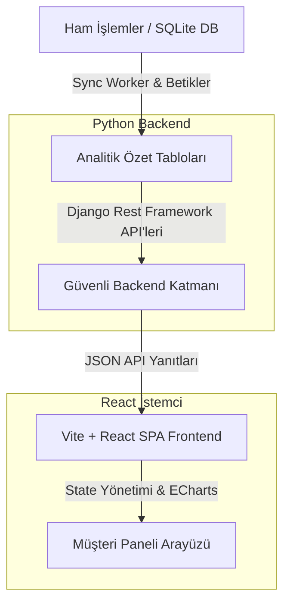

# 🚀 MarketFlow: Yapay Zekâ Destekli Perakende Analitiği ve CRM Platformu

MarketFlow, perakende operasyonları için geliştirilmiş, kurumsal düzeyde bir tam-yığın analitik platformu ve CRM paneli uygulamasıdır. Ham işlem verilerini gelişmiş ürün performansı takibi, RFM (Yenilik, Sıklık, Parasal) segmentasyonu, sepet analizi ve yapay zekâ destekli kampanya öneri motorları kullanarak aksiyon alınabilir içgörülere dönüştürür.

> [!NOTE]
> Bu depo, platformun tamamen işlevsel, temizlenmiş bir demo sürümünü içermektedir. Tüm kişisel veriler (PII), mağaza unvanları ve hassas kimlik bilgileri tamamen temizlenmiş; yerel SQLite motoru ile çalışan jenerik mock veri setleriyle değiştirilmiştir.

---

### 📸 Ekran Görüntüleri
<p align="center">
  
  
</p>
<p align="center">
  
  
</p>

---

### ✨ Öne Çıkan Özellikler
- **📊 Etkileşimli Yönetici Paneli**: Apache ECharts kütüphanesiyle Ciro, Ortalama Sepet Tutarı (AOV), Aktif Müşteriler ve Churn Oranı gibi kritik iş metriklerinin yüksek kaliteli görselleştirilmesi.
- **🎯 Gelişmiş Müşteri Segmentasyonu (RFM)**: Müşterileri Yenilik (Recency), Sıklık (Frequency) ve Parasal (Monetary) değerlerine göre otomatik olarak 10 farklı segmente sınıflandırma.
- **📈 Ürün ve Marka Analitiği**: İşlem bazlı satış performansları, marka sadakati takibi ve sepet birliktelik kuralları (Market Basket Analysis).
- **🤖 Otonom Kampanya Önerileri**: Alışveriş alışkanlıkları, ürün ilişkileri ve fiyat esnekliği modellerine göre hedefli kampanyalar (Çapraz Satış, Churn Önleme) üretme.
- **⚡ Yüksek Performanslı Önbellek Katmanı**: Panellerin milisaniyeler içinde yüklenmesini sağlayan önceden hesaplanmış analitik özet tabloları.
- **🛡️ SQLite/PostgreSQL Çift Motor Desteği**: Lokal demo ortamı için hafif SQLite yapısı ile üretim ortamı için PostgreSQL arasında şeffaf geçiş sağlayan veritabanı soyutlama katmanı.

---

### 🏛️ Sistem Mimarisi



---

### 🧮 Analitik Veri Modelleri ve RFM Metotları

CRM motorunun merkezinde, müşteri tabanını skorlamak ve segmentlere ayırmak için klasik **RFM Metodolojisi** kullanılır:

1. **Yenilik (Recency - $R$)**: Müşterinin son alışverişinden bu yana geçen gün sayısı.
   $$\text{Yenilik} = \text{Mevcut Tarih} - \text{Son Alışveriş Tarihi}$$
2. **Sıklık (Frequency - $F$)**: Toplam fatura/ziyaret sayısı.
3. **Parasal Değer (Monetary - $M$)**: Müşterinin yaptığı toplam harcama tutarı.

Müşteriler bu üç boyutta $1$ ile $5$ arasında skorlanır. Elde edilen RFM kodlarına göre (örneğin Şampiyonlar için `555`) segmentler belirlenir:
- **Şampiyonlar (Champions)**: $R \in [4, 5]$, $F \in [4, 5]$, $M \in [4, 5]$
- **Risk Altındakiler (At Risk)**: $R \in [1, 2]$, $F \in [3, 5]$, $M \in [3, 5]$
- **Uykuda Olanlar (About to Sleep)**: $R \approx 3$, $F \leq 2$, $M \leq 2$

#### Önceden Hesaplanan Analitik Önbellek Şeması:
- `musteridetayozet`: Müşteri adı, segmenti, tahmini yaşam boyu değeri (CLV), churn riski ve alışveriş geçmişini önceden birleştirir.
- `musterietiketler`: Belirli alıcı kalıplarını işaretler (örn. *İndirim Avcısı, Atıştırmalık Odaklı, Kasap Odaklı, Hafta Sonu Alışverişçisi*).
- `grupbirliktelikleri`: Çapraz satış önerileri için Birliktelik Kurallarını (Support, Confidence, Lift) önbelleğe alır.

---

### 🛠️ Teknoloji Yığını
- **Frontend**: React 18, TypeScript, Vite, Mantine UI Bileşenleri, Apache ECharts, Axios
- **Backend**: Python 3.10+, Django 5.x, Django REST Framework, SQLite3 (PostgreSQL uyumluluk moduyla)
- **Veri Analitiği**: Pandas, NumPy (toplu analitik işlemler için)

---

### 🚀 Kurulum ve Çalıştırma

#### Gereksinimler
- Node.js (v18+)
- Python (3.10+)

#### 1. Projeyi Klonlayın
```bash
git clone https://github.com/mehmetakiffkilicc/market_analitik.git
cd market_analitik
```

#### 2. Backend Kurulumu
```bash
cd backend
python -m venv .venv
# Sanal ortamı aktifleştirin
# Windows: .venv\Scripts\activate
# Unix/macOS: source .venv/bin/activate
pip install -r requirements.txt

# Veritabanı şemasını oluşturun ve mock verileri yükleyin
python manage.py migrate
python -X utf8 generate_mock_db.py
python -X utf8 rebuild_demo_db_summaries.py

# Django Geliştirme Sunucusunu Başlatın
python manage.py runserver
```

#### 3. Frontend Kurulumu
```bash
cd ../frontend
npm install
npm run dev
```
Tarayıcınızda `http://localhost:3001` adresine gidin.

---

### 🛡️ Veri Gizliliği ve Temizleme
- **Gerçek Kişisel Veri Yoktur**: E-posta adresleri, telefon numaraları veya fiziksel adresler kesinlikle saklanmaz.
- **Anonimleştirilmiş Veritabanı**: Varsayılan veritabanı `database/demo.sqlite3`, rastgele simüle edilmiş işlem tarihleri, jenerik müşteri etiketleri ve sentetik ürün katalogları kullanır.
- **Fikri Mülkiyet**: Orijinal ürüne ait tahmine dayalı özel algoritmalar ve hassas entegrasyonlar, açık paylaşım için basitleştirilmiş yapılarla değiştirilmiştir.

---

### 📄 Lisans
Bu proje, portfolyo ve demo gösterimi amacıyla hazırlanmıştır. Tüm hakları saklıdır. Mehmet Akif Kılıç.
